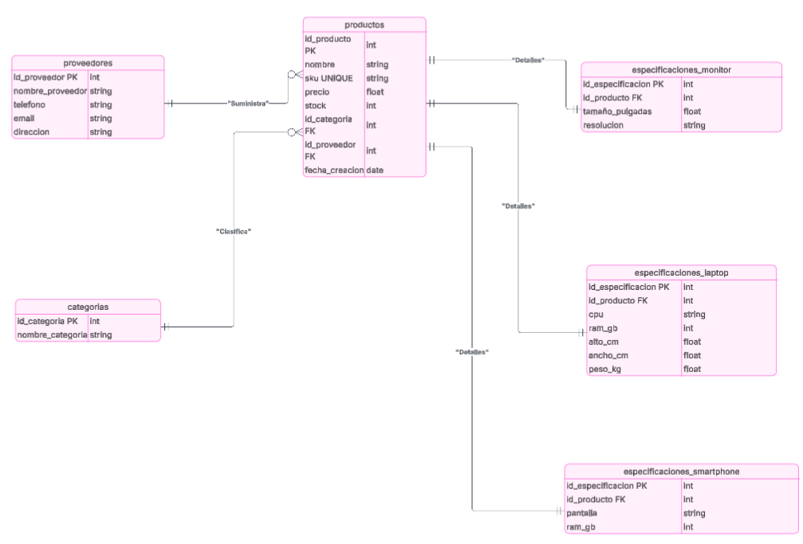
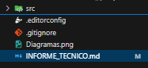
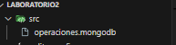

# Universidad de las Fuerzas Armadas ESPE

## Departamento de Ciencias de la Computación

### Carrera: Tecnologías de la Información

**Asignatura:** Modelado Avanzado de Base de Datos
**Período Lectivo:** 202551
**Nivel:** Sexto
**Docente:** Ing. Paulo Galarza, Mgtr.
**NRC:** 30765
**Práctica N.º:** 1
**Estudiante:** Carlos Calapucha

---

## Laboratorio donde se desarrollará la práctica

**Tema de la práctica:**
**Migración conceptual y despliegue de un sistema de gestión de inventarios (SGI) de un modelo relacional a un modelo NoSQL orientado a documentos (MongoDB).**

---

## 1. Introducción

En el desarrollo de software moderno, la elección de la base de datos es una decisión de arquitectura fundamental.
Mientras que los modelos relacionales (SQL) ofrecen una gran consistencia y estructura, los modelos **NoSQL** han surgido para manejar volúmenes masivos de datos con esquemas flexibles y escalabilidad horizontal.

Este laboratorio tiene como objetivo aplicar los fundamentos teóricos de las bases de datos NoSQL, comparando su enfoque con el modelo relacional tradicional y aplicando operaciones **CRUD** en **MongoDB** para resolver un caso de estudio concreto.

---

## 2. Objetivos

- Analizar un caso de estudio y justificar la elección de una base de datos NoSQL (MongoDB) frente a una solución SQL.
- Diseñar un modelo de datos conceptual (esquema JSON) para una colección en MongoDB, aplicando características como el anidamiento de documentos.
- Implementar la solución diseñada en un entorno MongoDB (local o Atlas).
- Ejecutar operaciones fundamentales de tratamiento de datos (**Inserción**, **Lectura** y **Actualización**) utilizando la sintaxis de **mongosh** en archivos `.mongodb`.

---

## 3. MARCO TEÓRICO:

Una base de datos NoSQL (Not Only SQL) es un modelo de almacenamiento no relacional que permite manejar
información con estructuras dinámicas. Entre sus tipos más comunes se encuentran las bases de documentos,
clave-valor, grafos y columnas.
MongoDB es un sistema NoSQL orientado a documentos que utiliza el formato BSON, una representación binaria
de JSON. Cada documento contiene pares clave-valor, lo que permite almacenar datos jerárquicos, listas y
subdocumentos sin necesidad de múltiples tablas o relaciones.
El uso de esquemas JSON (JSON Schema) en MongoDB permite establecer validaciones para garantizar la
integridad de los datos, definiendo campos obligatorios, tipos de datos y restricciones.
Este enfoque combina la flexibilidad del modelo NoSQL con cierto control estructural propio del modelo relacional.

## 4. DESCRIPCIÓN DEL PROCEDIMIENTO:

**PARTE 1: Actividades por Desarrollar**
En su archivo INFORME_TECNICO.md, cree una tabla comparativa donde justifique la elección de MongoDB
para el caso "TechStore"

## 1. Análisis Comparativo (SQL vs NoSQL)

| **Criterio**                | **Solución Relacional (SQL)**                                                                                                                        | **Solución NoSQL (MongoDB)**                                                                                | **Justificación para "TechStore"**                                                                                                                                                             |
| --------------------------- | ---------------------------------------------------------------------------------------------------------------------------------------------------- | ----------------------------------------------------------------------------------------------------------- | ---------------------------------------------------------------------------------------------------------------------------------------------------------------------------------------------- |
| **Flexibilidad de Esquema** | Rígido: cada modificación requiere `ALTER TABLE` o crear nuevas tablas para diferentes tipos de producto.                                            | Flexible: los documentos JSON/BSON permiten agregar nuevos campos o estructuras sin afectar los existentes. | En _TechStore_, cada tipo de producto (Laptop, Smartphone, Monitor) tiene especificaciones distintas. MongoDB permite almacenar todas en un solo documento, sin rediseñar el esquema cada vez. |
| **Modelo de Datos**         | Tablas normalizadas: `productos`, `especificaciones_laptop`, `especificaciones_monitor`, `especificaciones_smartphone`, `proveedores`, `categorias`. | Colección única `productos` con subdocumentos embebidos para proveedor, categoría y especificaciones.       | El modelo documental reduce la complejidad y elimina la necesidad de múltiples claves foráneas. Cada producto contiene toda su información completa y coherente dentro de un solo documento.   |
| **Consulta de Datos**       | Requiere múltiples `JOINs` para unir productos con proveedores, categorías y especificaciones.                                                       | Las consultas se realizan sobre un único documento, sin uniones.                                            | En _TechStore_, obtener toda la información de un producto es más rápido y sencillo, ya que todos los datos están anidados dentro del mismo documento.                                         |
| **Escalabilidad**           | Vertical: aumentar capacidad requiere servidores más potentes.                                                                                       | Horizontal: permite distribuir los datos entre varios nodos fácilmente.                                     | MongoDB ofrece mejor desempeño si _TechStore_ crece en volumen de productos o usuarios, facilitando su despliegue en la nube (Atlas).                                                          |
| **Integridad de Datos**     | Alta, gracias a las claves foráneas y restricciones de integridad.                                                                                   | Requiere validadores (`$jsonSchema`) y control en la aplicación.                                            | Aunque el modelo NoSQL es más flexible, MongoDB permite establecer validaciones que aseguran la consistencia básica sin perder agilidad.                                                       |
|                             |

## Parte 2. Diseño del Modelo Relacional

El siguiente diagrama representa cómo se vería el caso "TechStore" en un modelo relacional tradicional (SQL):



> **Nota:** El modelo relacional utiliza tablas relacionadas por claves foráneas, lo cual complica las consultas y actualizaciones cuando los productos tienen diferentes tipos de especificaciones.

---

## Parte 3. Diseño del Modelo NoSQL (MongoDB)



A continuación, se presenta la estructura del documento JSON para la colección `productos` en MongoDB.
Incluye ejemplos de un **Smartphone** y una **Laptop** para mostrar la flexibilidad del esquema.

```json
// Colección: productos
db.createCollection("productos", {
  validator: {
    $jsonSchema: {
      bsonType: "object",
      required: ["nombre", "sku", "precio", "stock", "tipo_producto"],
      properties: {
        nombre: { bsonType: "string" },
        sku: { bsonType: "string" },
        precio: { bsonType: "number" },
        stock: { bsonType: "number" },
        tipo_producto: { bsonType: "string", enum: ["Laptop", "Smartphone", "Monitor"] },
        fecha_creacion: { bsonType: "date" },
        categoria: {
          bsonType: "object",
          required: ["nombre_categoria"],
          properties: {
            nombre_categoria: { bsonType: "string" },
          },
        },
        proveedor: {
          bsonType: "object",
          required: ["nombre_proveedor"],
          properties: {
            nombre_proveedor: { bsonType: "string" },
            telefono: { bsonType: "string" },
            email: { bsonType: "string" },
            direccion: { bsonType: "string" },
          },
        },
        especificaciones: {
          bsonType: "object",
          properties: {
            // Laptop
            cpu: { bsonType: "string" },
            ram_gb: { bsonType: "number" },
            alto_cm: { bsonType: "number" },
            ancho_cm: { bsonType: "number" },
            peso_kg: { bsonType: "number" },
            // Smartphone
            pantalla: { bsonType: "string" },
            // Monitor
            tamaño_pulgadas: { bsonType: "number" },
            resolucion: { bsonType: "string" },
          },
        },
      },
    },
  },
});

> **Ventaja:** MongoDB permite almacenar diferentes tipos de productos con atributos personalizados dentro de la misma colección, evitando la necesidad de tablas separadas.

---
```

## PARTE 2: Fase 2: Implementación y Manipulación

## Parte 1 :

Cree el archivo operaciones.mongodb.

