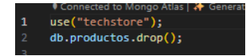
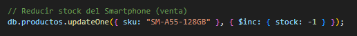

# Universidad de las Fuerzas Armadas ESPE

## Departamento de Ciencias de la Computación

### Carrera: Tecnologías de la Información

**Asignatura:** Modelado Avanzado de Base de Datos
**Período Lectivo:** 202551
**Nivel:** Sexto
**Docente:** Ing. Paulo Galarza, Mgtr.
**NRC:** 30765
**Práctica N.º:** 1
**Estudiante:** Carlos Calapucha

---

## Laboratorio donde se desarrollará la práctica

**Tema de la práctica:**
**Migración conceptual y despliegue de un sistema de gestión de inventarios (SGI) de un modelo relacional a un modelo NoSQL orientado a documentos (MongoDB).**

---

## 1. Introducción

En el desarrollo de software moderno, la elección de la base de datos es una decisión de arquitectura fundamental.
Mientras que los modelos relacionales (SQL) ofrecen una gran consistencia y estructura, los modelos **NoSQL** han surgido para manejar volúmenes masivos de datos con esquemas flexibles y escalabilidad horizontal.

Este laboratorio tiene como objetivo aplicar los fundamentos teóricos de las bases de datos NoSQL, comparando su enfoque con el modelo relacional tradicional y aplicando operaciones **CRUD** en **MongoDB** para resolver un caso de estudio concreto.

---

## 2. Objetivos

- Analizar un caso de estudio y justificar la elección de una base de datos NoSQL (MongoDB) frente a una solución SQL.
- Diseñar un modelo de datos conceptual (esquema JSON) para una colección en MongoDB, aplicando características como el anidamiento de documentos.
- Implementar la solución diseñada en un entorno MongoDB (local o Atlas).
- Ejecutar operaciones fundamentales de tratamiento de datos (**Inserción**, **Lectura** y **Actualización**) utilizando la sintaxis de **mongosh** en archivos `.mongodb`.

---

## 3. MARCO TEÓRICO:

Una base de datos NoSQL (Not Only SQL) es un modelo de almacenamiento no relacional que permite manejar
información con estructuras dinámicas. Entre sus tipos más comunes se encuentran las bases de documentos,
clave-valor, grafos y columnas.

MongoDB es un sistema NoSQL orientado a documentos que utiliza el formato BSON, una representación binaria
de JSON. Cada documento contiene pares clave-valor, lo que permite almacenar datos jerárquicos, listas y
subdocumentos sin necesidad de múltiples tablas o relaciones.

El uso de esquemas JSON (JSON Schema) en MongoDB permite establecer validaciones para garantizar la
integridad de los datos, definiendo campos obligatorios, tipos de datos y restricciones.
Este enfoque combina la flexibilidad del modelo NoSQL con cierto control estructural propio del modelo relacional.

---

## 4. DESCRIPCIÓN DEL PROCEDIMIENTO:

**PARTE 1: Actividades por Desarrollar**

En su archivo INFORME_TECNICO.md, cree una tabla comparativa donde justifique la elección de MongoDB
para el caso "TechStore"

### 1. Análisis Comparativo (SQL vs NoSQL)

| **Criterio**                | **Solución Relacional (SQL)**                                                                                                                        | **Solución NoSQL (MongoDB)**                                                                                | **Justificación para "TechStore"**                                                                                                                                                             |
| --------------------------- | ---------------------------------------------------------------------------------------------------------------------------------------------------- | ----------------------------------------------------------------------------------------------------------- | ---------------------------------------------------------------------------------------------------------------------------------------------------------------------------------------------- |
| **Flexibilidad de Esquema** | Rígido: cada modificación requiere `ALTER TABLE` o crear nuevas tablas para diferentes tipos de producto.                                            | Flexible: los documentos JSON/BSON permiten agregar nuevos campos o estructuras sin afectar los existentes. | En _TechStore_, cada tipo de producto (Laptop, Smartphone, Monitor) tiene especificaciones distintas. MongoDB permite almacenar todas en un solo documento, sin rediseñar el esquema cada vez. |
| **Modelo de Datos**         | Tablas normalizadas: `productos`, `especificaciones_laptop`, `especificaciones_monitor`, `especificaciones_smartphone`, `proveedores`, `categorias`. | Colección única `productos` con subdocumentos embebidos para proveedor, categoría y especificaciones.       | El modelo documental reduce la complejidad y elimina la necesidad de múltiples claves foráneas. Cada producto contiene toda su información completa y coherente dentro de un solo documento.   |
| **Consulta de Datos**       | Requiere múltiples `JOINs` para unir productos con proveedores, categorías y especificaciones.                                                       | Las consultas se realizan sobre un único documento, sin uniones.                                            | En _TechStore_, obtener toda la información de un producto es más rápido y sencillo, ya que todos los datos están anidados dentro del mismo documento.                                         |
| **Escalabilidad**           | Vertical: aumentar capacidad requiere servidores más potentes.                                                                                       | Horizontal: permite distribuir los datos entre varios nodos fácilmente.                                     | MongoDB ofrece mejor desempeño si _TechStore_ crece en volumen de productos o usuarios, facilitando su despliegue en la nube (Atlas).                                                          |
| **Integridad de Datos**     | Alta, gracias a las claves foráneas y restricciones de integridad.                                                                                   | Requiere validadores (`$jsonSchema`) y control en la aplicación.                                            | Aunque el modelo NoSQL es más flexible, MongoDB permite establecer validaciones que aseguran la consistencia básica sin perder agilidad.                                                       |

---

### Parte 2. Diseño del Modelo Relacional

El siguiente diagrama representa cómo se vería el caso "TechStore" en un modelo relacional tradicional (SQL):


> **Nota:** El modelo relacional utiliza tablas relacionadas por claves foráneas, lo cual complica las consultas y actualizaciones cuando los productos tienen diferentes tipos de especificaciones.

---

### Parte 3. Diseño del Modelo NoSQL (MongoDB)


A continuación, se presenta la estructura del documento JSON para la colección `productos` en MongoDB.
Incluye ejemplos de un **Smartphone** y una **Laptop** para mostrar la flexibilidad del esquema.

```json
// Colección: productos
db.createCollection("productos", {
  validator: {
    $jsonSchema: {
      bsonType: "object",
      required: ["nombre", "sku", "precio", "stock", "tipo_producto"],
      properties: {
        nombre: { bsonType: "string" },
        sku: { bsonType: "string" },
        precio: { bsonType: "number" },
        stock: { bsonType: "number" },
        tipo_producto: { bsonType: "string", enum: ["Laptop", "Smartphone", "Monitor"] },
        fecha_creacion: { bsonType: "date" },
        categoria: {
          bsonType: "object",
          required: ["nombre_categoria"],
          properties: {
            nombre_categoria: { bsonType: "string" },
          },
        },
        proveedor: {
          bsonType: "object",
          required: ["nombre_proveedor"],
          properties: {
            nombre_proveedor: { bsonType: "string" },
            telefono: { bsonType: "string" },
            email: { bsonType: "string" },
            direccion: { bsonType: "string" },
          },
        },
        especificaciones: {
          bsonType: "object",
          properties: {
            // Laptop
            cpu: { bsonType: "string" },
            ram_gb: { bsonType: "number" },
            alto_cm: { bsonType: "number" },
            ancho_cm: { bsonType: "number" },
            peso_kg: { bsonType: "number" },
            // Smartphone
            pantalla: { bsonType: "string" },
            // Monitor
            tamaño_pulgadas: { bsonType: "number" },
            resolucion: { bsonType: "string" },
          },
        },
      },
    },
  },
});
```

> **Ventaja:** MongoDB permite almacenar diferentes tipos de productos con atributos personalizados dentro de la misma colección, evitando la necesidad de tablas separadas.

---

## PARTE 2: Fase 2: Implementación y Manipulación

### Parte 1: Configuración Inicial


● Cree el archivo operaciones.mongodb.

● Añada los comandos para conectarse a su base de datos (Atlas o local) y seleccionar la base de datos techstore.


● Añada un comando para borrar la colección productos al inicio, para asegurar que el script sea re-ejecutable.



---

### Parte 2: Inserción de Datos (Create)

Añada un comando db.productos.insertMany() para insertar 3 productos en la colección, siguiendo el diseño de la Fase 1:

- Un (1) Smartphone.
- Una (1) Laptop.
- Un (1) Monitor.

```json
// Insertar: productos
db.productos.insertMany([
  {
    nombre: "Laptop Lenovo ThinkPad X1",
    sku: "LAP-THINKX1",
    precio: 1200,
    stock: 8,
    tipo_producto: "Laptop",
    fecha_creacion: new Date(),
    categoria: { nombre_categoria: "Computadoras" },
    proveedor: {
      nombre_proveedor: "Tech Supplier S.A.",
      telefono: "0999999999",
      email: "ventas@techsupplier.com",
      direccion: "Av. Central 123, Quito",
    },
    especificaciones: {
      cpu: "Intel Core i7",
      ram_gb: 16,
      alto_cm: 2.5,
      ancho_cm: 35,
      peso_kg: 1.8,
    },
  },
  {
    nombre: "Smartphone Galaxy A55",
    sku: "SM-A55-128GB",
    precio: 650,
    stock: 15,
    tipo_producto: "Smartphone",
    fecha_creacion: new Date(),
    categoria: { nombre_categoria: "Celulares" },
    proveedor: {
      nombre_proveedor: "MobileCorp",
      telefono: "0987654321",
      email: "contacto@mobilecorp.com",
      direccion: "Av. Las Américas, Guayaquil",
    },
    especificaciones: {
      pantalla: '6.5"',
      ram_gb: 8,
    },
  },
  {
    nombre: "Monitor LG UltraWide 29"",
    sku: "MON-LG29UW",
    precio: 350,
    stock: 20,
    tipo_producto: "Monitor",
    fecha_creacion: new Date(),
    categoria: { nombre_categoria: "Monitores" },
    proveedor: {
      nombre_proveedor: "Displays Ecuador",
      telefono: "0977777777",
      email: "ventas@displays.ec",
      direccion: "Calle Norte 456, Santo Domingo",
    },
    especificaciones: {
      tamaño_pulgadas: 29,
      resolucion: "2560x1080",
    },
  },
]);
```

---

### Parte 3: Lectura de Datos (Read)

● Añada comentarios claros (//) separando cada consulta.

**● Consulta 1: Mostrar todos los productos en la colección. (find())**


**● Consulta 2: Mostrar solo los productos que sean de tipo "Laptop".**


**● Consulta 3: Mostrar los productos que tengan más de 10 unidades en stock Y un precio menor a 1000.**


**● Consulta 4: Mostrar solo el nombre, precio y stock de los "Smartphone" (Proyección).**


---

### Parte 4: Actualización de Datos (Update)

**● Operación 1: Se vendió un Smartphone (busque uno por su sku). Reduzca su stock en 1 unidad. (Use $inc)**




**● Operación 2: El precio de la Laptop ha subido. Actualice su precio a un nuevo valor y añada un nuevo campo ultima_revision: new Date(). (Use $set).**


---

## PARTE 3: Análisis Reflexivo

### Pregunta 1: ¿Cuál fue la ventaja más significativa de usar un modelo de documento (MongoDB) para el caso "TechStore" en comparación con el modelo relacional que diseñó?

El beneficio más importante fue la unificación de toda la información del producto en un único archivo JSON, lo que hizo innecesarias las relaciones y tablas múltiples.

En el modelo relacional, los artículos, categorías, proveedores y especificaciones estaban divididos en múltiples tablas. Esto requería la ejecución de consultas que involucraran varios JOIN.

Esta información en MongoDB se anida dentro del mismo documento, lo que optimiza la rapidez de lectura, simplifica la estructura lógica y disminuye la dificultad de las consultas.

---

### Pregunta 2: ¿Cómo facilita el anidamiento de documentos (el campo especificaciones) la gestión de datos heterogéneos (diferentes atributos por producto)?

El anidamiento posibilita que cada producto cuente con su conjunto individual de campos especializados sin que sea necesario crear tablas independientes.

Por ejemplo, en la misma colección de productos se pueden encontrar características como cpu y ram_gb para una computadora portátil, o pantalla y cámara_mp para un teléfono inteligente.

---

### Pregunta 3: ¿Qué problemas potenciales podría enfrentar esta base de datos a futuro si no se controla la flexibilidad del esquema (es decir, si se permite insertar cualquier dato)?

El anidamiento posibilita que cada producto cuente con su conjunto individual de campos especializados sin que sea necesario crear tablas independientes.

En la misma colección, prod, por ejemplo, una computadora portátil puede tener características como CPU y RAM_GB, mientras que un teléfono inteligente puede incluir cámara MP y pantalla. La mayor desventaja es el riesgo de que los datos pierdan su integridad y consistencia.

Si no se valida la estructura a través de un esquema JSON, es posible que se almacenen documentos que contengan campos incorrectos, tipos de datos inconsistentes o información esencial faltante.

Esto causaría problemas para consultar, filtrar o mantener los datos a lo largo del tiempo, lo que tendría un impacto directo en la fiabilidad del sistema.

---

### Pregunta 4: ¿Qué paso técnico recomendaría a continuación para "profesionalizar" esta base de datos? (Piense en rendimiento e integridad de datos que no cubrimos en este laboratorio).

Determinar un esquema JSON más estricto, que establezca campos obligatorios, categorías de datos aceptables y límites permitidos para valores numéricos.

Para mejorar las consultas más comunes, se deben crear índices en los campos tipo_producto, sku y proveedor.nombre_proveedor.

Activar en el servidor de MongoDB la validación automática y las reglas del negocio.

Para garantizar la disponibilidad y la recuperación en caso de fallos, es necesario poner en marcha copias de seguridad automáticas y un control de versiones de los datos.

Si la cantidad de información aumenta, implementar métodos de particionamiento (sharding) asegurando la escalabilidad y el rendimiento.

---

## 5. CONCLUSIONES:

- El uso de MongoDB permitió simplificar drásticamente el modelo de datos del caso "TechStore", eliminando la necesidad de múltiples tablas y relaciones propias del modelo relacional. Toda la información relevante de un producto (categoría, proveedor y especificaciones técnicas) puede almacenarse en un único documento, reduciendo la complejidad del diseño y las operaciones de consulta.

- El anidamiento de subdocumentos mejoró el rendimiento y la claridad del sistema, ya que las lecturas se realizan sobre un único documento sin depender de operaciones JOIN. Este enfoque vuelve más eficiente el acceso a datos heterogéneos, especialmente en catálogos donde cada tipo de producto posee atributos diferentes.

- Aunque MongoDB ofrece una gran flexibilidad en el esquema, el uso de validadores $jsonSchema es fundamental para mantener la integridad de los datos en el tiempo. La implementación de validaciones, índices y buenas prácticas de modelado permite que una base NoSQL no solo sea flexible, sino también profesional, robusta y escalable para escenarios reales.

---

## 6. BIBLIOGRAFÍA:

MongoDB. (s. f.). ¿Qué es MongoDB? https://www.mongodb.com/es/company/what-is-mongodb
